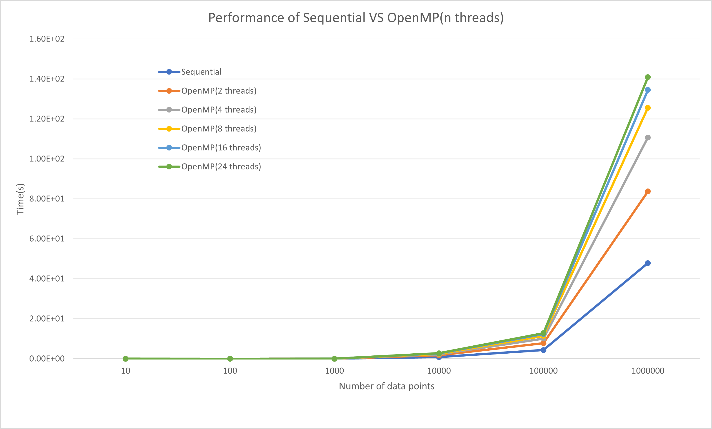

# CSCI596-Final-Project

This repository is mainly about parallelizing KMeans algorithm.

# Introduction to the KMeans Algorithm

KMeans is a popular clustering algorithm used in unsupervised learning tasks. Suppose that a dataset has N data points and the major goal of the KMeans algorithm is to partition it into K clusters where K is a hyper parameter. 


## Steps
1. Randomly initialize K cluster centriods
2. For each data point, compute its Euclidean distance to the centriods and assign the data point to the cluster whose centroid is the cloest
3. Recalculate the centroid of each cluster by averaging all the data points in that cluster
4. Repeat step 2 and 3 until the algorithm converages

## Parallelization
In step 2, we can create multiple workers (processes or threads) and each worker will assign some data points to their cloest cluster.

We plan to implement the following methods:
* a sequential implementation without any parallelization
* use OpenMP to implement the parallelization
* use MPI to implement the parallelization
* hybrid MPI+OpenMP parallelization implementation

# Implementation

## Repository Structure
- `util.cpp` : utility functions
- `data.cpp` : randomly generate datasets and use that to train the algorithm
- `kmeans.cpp` : implementation of sequential and OpenMP KMeans algorithm
- `mpi_kmeans.cpp` : implementation of MPI and hybrid MPI+OpenMP Kmeans algorithm
- `kemans.sl` : slurm script submitted to CARC
 
## Dataset Generation
```
g++ data.cpp util.cpp -o data
./data -o {number of data points} -d {number of dimensions}
```

## Sequential and OpenMP Implementation
```
g++ main.cpp util.cpp kmeans.cpp -fopenmp -lm -o main

# Sequential implementation
./main

# Add a -t command arg to use Openmp
./main -t {number of threads}

# Add a -s command arg to specify dataset
./main -t {number of threads} -s {name of dataset file}

# Add a -k command arg to the hyper parameter K
./main -t {number of threads} -s {name of dataset file} -k {K}
```

## MPI Implementation
* Before compiling the program, run the following command in your CARC terminal
```
export LD_PRELOAD=/spack/apps/gcc/8.3.0/lib64/libstdc++.so.6
```

* Compile and Execute program
```
mpic++ mpi_main.cpp mpi_kmeans.cpp util.cpp -fopenmp -lm -o mpi_main

# MPI implementation
mpiexec -n ${number of processes} ./mpi_main

# use -s to specify the dataset
mpiexec -n ${number of processes} ./mpi_main -s {name of dataset}

# use -t to activate OpenMP + MPI
mpiexec -n ${number of processes} ./mpi_main -s {name of dataset} -t ${number of threads for each process}

# use -k to specify the number of clusters
```
## Running Jobs on CARC
Modify the setting the submit the job
```
sbatch kmeans.sl
```

#  Results
## Sequential + OpenMP


## OpenMP


## Authors

If you have any questions, feel free to reach out via zhihaoma@usc.edu.
